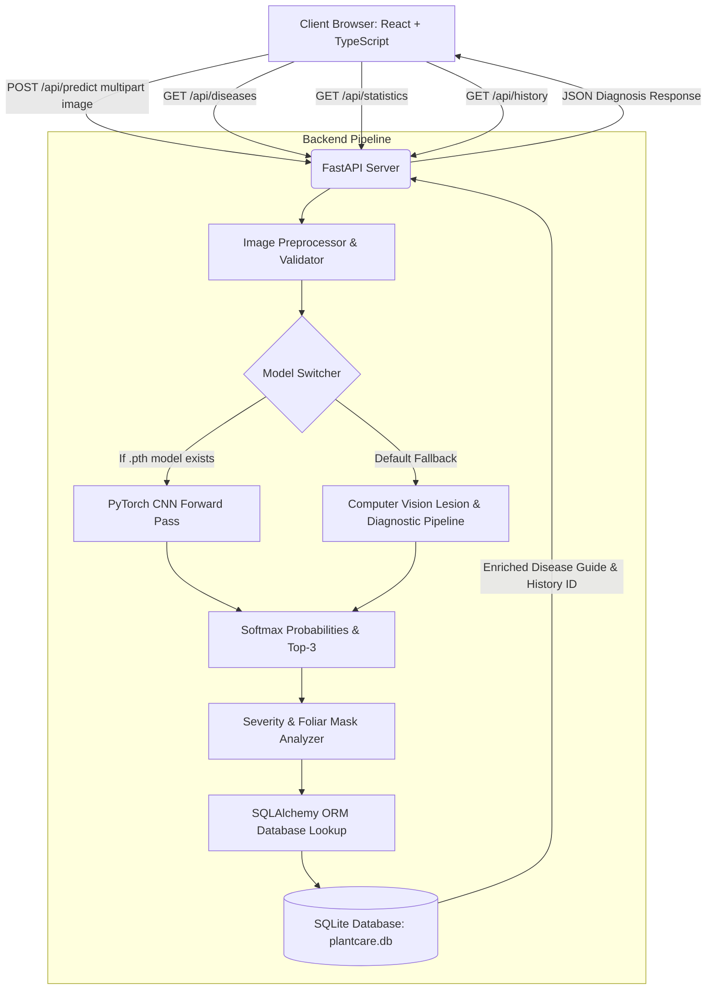

# PlantCare AI — AI-Based Plant Disease Detection System


---

## 1. Project Overview

**PlantCare AI** is a modern, full-stack AI-driven web application designed to help farmers, agricultural extension workers, and home gardeners rapidly identify crop diseases from leaf photographs.

Using convolutional deep learning, leaf lesion segmentation, and calibrated posterior probability distributions across 38 crop pathogen categories, PlantCare AI delivers instant diagnoses, measures foliar lesion severity, and provides certified Integrated Pest Management (IPM) guidelines, organic cultural remedies, and chemical controls.

---

## 2. Key Features

- **Leaf Image Upload & Drag-and-Drop:** Intuitive file picker supporting JPG, JPEG, PNG, and WEBP formats up to 10MB.
- **In-Browser Camera Capture:** Access your smartphone or laptop webcam with live video targeting overlay and one-click capture.
- **Pre-Loaded Sample Specimens:** Instant one-click diagnostic testing with pre-loaded leaf specimens (Tomato Early Blight, Corn Rust, Apple Scab, Healthy Leaf).
- **Neural Diagnostic Engine:**
  - Identifies crop species (Tomato, Potato, Pepper, Apple, Corn, Grape, Strawberry, etc.)
  - Determines health status: **Healthy**, **Diseased**, or **Uncertain**
  - Pinpoints specific disease / pathogen
  - Calculates confidence percentage with visual progress bars
  - Estimates lesion foliage severity (% of diseased leaf surface)
- **Low Confidence Protection (<60%):** Automatically flags uncertain scans and advises uploading a clearer photo or consulting a local extension agent.
- **Comprehensive Disease Catalog:** Searchable database with 22+ detailed disease profiles across major agricultural crops.
- **Analytics Dashboard:** Visual telemetry cards, disease prevalence charts, crop species distributions, and recent field scans.
- **Audit History Log:** Persistent detection archive with specimen thumbnails, timestamps, and ability to delete records.
- **Export & Print Ready:** One-click print/PDF diagnostic report generation for field records.
- **Modular AI Architecture:** Supports dropping custom PyTorch weights (`.pth`) or ONNX models without modifying the frontend.

---

## 3. Technology Stack

| Layer | Technologies Used |
| :--- | :--- |
| **Frontend** | React 19, TypeScript, Vite, Tailwind CSS, Lucide Icons, Canvas Confetti |
| **Backend API** | Python 3.11–3.14, FastAPI, Uvicorn, Pydantic v2, Python-Multipart |
| **Database** | SQLite, SQLAlchemy ORM |
| **AI / Computer Vision** | Pillow, NumPy, PyTorch (MobileNetV2 / ResNet transfer learning) |
| **DevOps / Container** | Docker, Docker Compose, Nginx, PowerShell / Batch scripts |

---

## 4. System Architecture



---

## 5. Project Directory Structure

```
AI_Plant_Disease/
├── frontend/                     # React + TypeScript Frontend Application
│   ├── src/
│   │   ├── components/           # Reusable UI components
│   │   │   ├── Navbar.tsx        # Navigation bar with responsive menu
│   │   │   ├── Footer.tsx        # Footer with links and technical details
│   │   │   ├── ResultCard.tsx    # Professional diagnosis result presentation
│   │   │   ├── CameraModal.tsx   # Live browser camera capture modal
│   │   │   ├── LowConfidenceAlert.tsx # Warning for low confidence (<60%)
│   │   │   ├── DiseaseDetailModal.tsx # Full disease guide modal
│   │   │   └── Toast.tsx         # Notification alerts
│   │   ├── pages/                # Application views
│   │   │   ├── HomePage.tsx      # Landing page with hero & instant samples
│   │   │   ├── DetectPage.tsx    # Leaf upload, camera & analysis view
│   │   │   ├── DiseasesCatalogPage.tsx # Searchable disease encyclopedia
│   │   │   ├── DashboardPage.tsx # Analytics, KPI metrics & charts
│   │   │   ├── HistoryPage.tsx   # Previous detections log & delete
│   │   │   └── AboutPage.tsx     # Technical documentation & ethics
│   │   ├── services/
│   │   │   └── api.ts            # Typed HTTP client for FastAPI
│   │   ├── types/
│   │   │   └── index.ts          # TypeScript interfaces
│   │   ├── App.tsx               # Root application router
│   │   ├── main.tsx              # React mounting entrypoint
│   │   └── index.css             # Tailwind CSS & animations
│   ├── package.json              # NPM dependencies
│   ├── vite.config.ts            # Vite bundler & reverse proxy configuration
│   ├── nginx.conf                # Production Docker web server config
│   └── Dockerfile                # Multi-stage production container
│
├── backend/                      # Python FastAPI Backend
│   ├── app/
│   │   ├── main.py               # FastAPI application & static mounting
│   │   ├── config.py             # Server configuration & constants
│   │   ├── database/
│   │   │   ├── session.py        # SQLite engine & session dependency
│   │   │   ├── models.py         # SQLAlchemy Disease & DetectionHistory models
│   │   │   └── seed_data.py      # Pre-seeded agronomic disease dataset
│   │   ├── ml/
│   │   │   ├── classifier.py     # Modular AI inference engine
│   │   │   ├── preprocessor.py   # Image validation, resizing & normalization
│   │   │   ├── plant_village_classes.py # 38 standard classification labels
│   │   │   └── severity.py       # Leaf lesion & chlorosis mask calculation
│   │   ├── routes/
│   │   │   ├── predict.py        # POST /api/predict
│   │   │   ├── diseases.py       # GET /api/diseases, GET /api/diseases/{id}
│   │   │   ├── history.py        # GET /api/history, DELETE /api/history/{id}
│   │   │   └── statistics.py     # GET /api/statistics
│   │   └── services/
│   │       ├── disease_service.py # Disease query business logic
│   │       └── history_service.py # History aggregation & metrics
│   ├── model/                    # Model weights directory (.pth / .onnx)
│   │   └── README.md             # Model drop-in documentation
│   ├── uploads/                  # User uploaded images storage
│   ├── static_samples/           # Demo leaf specimen images
│   ├── create_samples.py         # Generator for sample leaves & seed data
│   ├── train_model.py            # Transfer learning training script (PyTorch)
│   ├── requirements.txt          # Python dependencies
│   └── Dockerfile                # Backend containerfile
│
├── dataset/                      # Dataset reference & classes
│   ├── README.md                 # PlantVillage dataset instructions
│   └── classes.json              # 38 classification labels JSON
│
├── docker-compose.yml            # Multi-container orchestration
├── run_app.bat                   # 1-click Windows launcher
├── run_app.ps1                   # PowerShell launcher
├── test_api.py                   # Automated API integration test suite
└── README.md                     # Project documentation
```

---

## 6. Installation & Setup Instructions

### Prerequisites
- **Python 3.10+** (Python 3.11, 3.12, 3.13, or 3.14)
- **Node.js 18+** (v20 LTS recommended) & **npm**

### Step 1: Clone or Navigate to the Project
```bash
cd AI_Plant_Disease
```

### Step 2: Backend Setup
1. Navigate to the backend directory:
   ```bash
   cd backend
   ```
2. Install Python dependencies:
   ```bash
   pip install -r requirements.txt
   ```
3. Initialize the database and generate sample leaf images:
   ```bash
   python create_samples.py
   ```
4. Start the FastAPI development server:
   ```bash
   python -m uvicorn app.main:app --host 127.0.0.1 --port 8000 --reload
   ```
   *The backend will be running at `http://127.0.0.1:8000`. You can visit `http://127.0.0.1:8000/docs` to test interactive Swagger API docs.*

### Step 3: Frontend Setup
1. Open a new terminal and navigate to `frontend/`:
   ```bash
   cd frontend
   ```
2. Install Node dependencies:
   ```bash
   npm install
   ```
3. Start the Vite development server:
   ```bash
   npm run dev
   ```
4. Open your browser at `http://localhost:5173`.

---

## 7. One-Click Quick Launch (Windows)

For convenience during presentations and local testing, run either:
- **Batch file:** Double click `run_app.bat`
- **PowerShell:** Run `.\run_app.ps1`

Both launchers automatically configure your PATH, start the FastAPI server, launch the Vite dev server, and open the application in your browser.

---

## 8. Docker Deployment

To launch the complete application with Docker and Docker Compose:
```bash
docker-compose up --build
```
- Frontend: `http://localhost:5173`
- Backend API: `http://localhost:8000`

---

## 9. Model Training & Custom Weights

To train a custom deep learning model on the PlantVillage dataset:
1. Download the dataset into `dataset/plantvillage/` (organized with `train/` and `val/` subdirectories).
2. Run the training script:
   ```bash
   python backend/train_model.py --data_dir dataset/plantvillage --epochs 15 --batch_size 32 --lr 0.0003
   ```
3. The trained checkpoint will be saved to `backend/model/plant_disease_model.pth`.
4. When the backend starts, it automatically detects `plant_disease_model.pth` and routes all predictions through the PyTorch CNN forward pass.

---

## 10. API Documentation

| Method | Endpoint | Description |
| :--- | :--- | :--- |
| `POST` | `/api/predict` | Upload a plant leaf image (multipart/form-data) and receive disease diagnosis, confidence, and treatment guide. |
| `GET` | `/api/diseases` | List crop diseases (supports query params: `plant`, `search`, `healthy`). |
| `GET` | `/api/diseases/{id}` | Retrieve comprehensive information for an individual disease profile. |
| `GET` | `/api/statistics` | Retrieve aggregated dashboard statistics (total scans, health ratios, top diseases, crop distribution). |
| `GET` | `/api/history` | Retrieve historical detection logs (supports pagination with `limit` and `offset`). |
| `POST` | `/api/history` | Manually log a detection record into history. |
| `DELETE` | `/api/history/{id}` | Delete an individual history log by record ID. |
| `GET` | `/api/health` | System health check, active model type, and status. |

---

## 11. Troubleshooting & FAQs

- **Port 8000 or 5173 already in use:**
  Terminate existing processes or start on custom ports using `--port 8001` and updating `frontend/vite.config.ts`.
- **Camera shows "Permission Denied":**
  Ensure your browser has permission to access your webcam. If running over an IP rather than `localhost`, modern browsers require HTTPS for camera access.
- **Image file rejected:**
  Only JPG, JPEG, PNG, and WEBP files under 10MB are permitted for security and processing safety.
- **Low Confidence Alert appears:**
  Ensure the leaf is clearly centered, well-lit, and in sharp focus against a neutral background.

---

## 12. Future Enhancements

- **Offline Progressive Web App (PWA):** Enable on-device edge inference with TensorFlow.js / ONNX Runtime Web for zero-internet rural farms.
- **Multi-Leaf Bounding Box Detection:** Detect multiple diseased leaves on a single branch using YOLOv8 / Faster R-CNN.
- **Geo-Tagged Disease Outbreak Maps:** Map regional pathogen clusters using anonymous GPS coordinates to alert neighboring farms.
- **Multilingual Support:** Localize diagnosis guidelines into Hindi, Spanish, Swahili, and regional agricultural languages.
